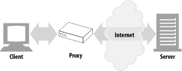
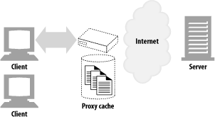
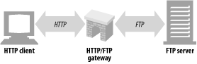
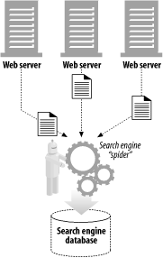

# HTTP  

시작에 앞서 클라이언트와 서버의 흐름에 대해 질문을 해보겠다. 웹 어플리케이션 서버가 http를 모른다 즉 어떻게 받아오는지 모른다고 가정을 해보자  
1. 클라이언트는 데이터가 존재하는 서버의 위치를 파악해야 한다.(Host)  
    - 데이터는 보통 다른 서버에서 받아오게 되는데, 수많은 서버 중 특정 서버를 가르키기 위해 해당 서버의 주소를 알아야 한다.  
2. 위치를 파악했다면 클라이언트와 서버의 연결이 필요하다.(TCP/IP 커넥션, port)  
3. 연결이 이루어졌다면, 서버가 원하는 바를 요청해야한다.(HTTP 프로토콜을 통해 요청/응답 메세지를 보낸다.)  
    - 서버와 클라이언트가 둘다 이해할 수 있는 공용 언어가 필요하다.  
    - 공용 언어에서 어떤 대화방식이 이루어지는지, 어떤 약속된 규칙으로 메세지를 주고받는지를 파악하고, 이 규칙을 지킨 요청 사항을 보낸다.  
4. 요청이나 응답에서 어떤 데이터를 보내고, 받았는지 데이터의 위치, 종류를 알아야, 클라이언트에서 해석할 수 있다.(Content-type, URL)  
    - 데이터는 종류가 많다. 일반 text부터 이미지, pdf파일까지 다양한 파일을 분류할 필요가 있다.  
    - 어떤 종류의 데이터가 오가고 있고 어떻게 해석해야 하는지 알려줘야 한다.    
5. 특정 상황에서 통신을 원활하게 해주는 다른 요소들이 필요하다(HTTP의 기반 시스템의 구성 요소)  
    - 서버의 데이터를 필터하는 과정이 필요하거나, 받은 데이터를 저장해서 서버 요청을 줄이는 등 특정 상황에서의 처리를 위한 요소가 필요하다  

앞서 설명한 모든 기능들은 HTTP의 전부이다. 이것에 대해 깊게 파고든 결과가 HTTP라고 할 수 있다.  

## HTTP 개념  
**http는 HTML 문서와 같은 리소스들을 가져올 수 있도록 해주는 프로토콜이다.**  
HTTP는 웹에서 이루어지는 모든 데이터 교환의 기초이며, 클라이언트-서버 프로토콜이기도 하다. 하나의 완전한 문서는 텍스트, 레이아웃 설명, 이미지, 비디오, 스크립트 등 불러온 하위 문서들로 재구성 된다.  
> 프로토콜이란?  
> 컴퓨터 내부에서, 또는 컴퓨터 사이에서 데이터의 교환 방식을 정의하는 규칙 체계  
  
클라이언트와 서버들은 개별적인 메세지 교환에 의해 통신한다. 보통 브라우저인 클라이언트에 의해 전송되는 메세지를 요청이라고 부르며, 그에 대해 서버에서 응답으로 전송되는 메세지를 응답이라고 부른다.  

## HTTP 기반 시스템의 구성요소  
HTTP는 클라이언트-서버 프로토콜이다. 요청은 하나의 개체, 사용자 에이전트에 의해 전송된다. 대부분의 경우, 사용자 에이전트는 브라우저지만, 무엇이든 될 수 있다.  

각각 개별적인 요청들은 서버로 보내지며, 서버는 요청에 처리하고 response라고 불리는 응답을 제공한다. 이 요청과 응답 사이에는 여러 개체들이 있는데, 예를 들어 다양한 작업을 수행하는 **게이트웨이** 혹은 **캐시** 역할을 하는 **프록시** 등이 있다.  
  
실제로는 브라우저와 요청을 처리하는 서버 사이에는 좀 더 많은 컴퓨터들이 존재한다. 라우터, 모뎀 등이 있다. 웹의 계층적인 설계 덕분에, 이들은 네트워크와 전송 계층 내로 숨겨진다. HTTP는 애플리케이션 계층의 최상위에 있다. 네트워크 문제를 진단하는 것도 중요하지만, 기본적인 레이어들은 HTTP의 명세서와는 거의 관련이 없다.  

## 클라이언트 측면  
클라이언트에게 있어서 알아야 하는 것이 무엇이 있을까? 원하는 데이터가 있는 서버의 위치를 알아야한다. 위치를 파악했다면 연결이 필요하다. 연결이 이루어져있다면, 서버에게 원하는 바를 요청해야한다. 어디에 있는 어떤 데이터인지를 알아야한다.  

## HTTP 활용  
만약 여러분이 사이트에 로그인을 한다고 가정을 하자, **HTTP는 이전에 보냈던 상태와 그 이후의 상태가 전혀 연관성이 없다**. 즉, 로그인 신호가 한번 도착했는데 다시 로그인 신호가 온다고 가정해보자 어떻게 해결하겠는가?  

앞에서도 로그인 신호를 보내서 로그인을 처리해줬지만 뒤에서는 그 사실을 전혀 모른다 왜냐하면 HTTP는 상태를 저장하지 않기 때문이다(**Stateless**) 이를 해결하기 위해 **HTTP 쿠키**를 활용한다. 이 쿠키는 상태가 있는 세션을 만들도록 해준다. 정확한 용도는 만약 HTTP가 데이터를 보낼때 작은 데이터 조각들을 모아둔다. 다음 전송이 이루어질때 같이 보내게 된다. 이런 정보들에 포함된 것들이 로그인 정보 같은것이 포함되 로그인이 유지되고 반복적인 처리가 발생하지 않는다.  

## HTTP 버전  
- HTTP 0.9  
    - GET형식 메소드만 지원  
    - HTTP헤더, 버전 번호는 지원하지 않는다.  
    - 간단한 HTML을 불러오기 위해 만들어졌으며 바로 1.0으로 대채되었다.  
- HTTP 1.0  
    - 처음으로 널리 쓰이기 시작한 HTTP 버전이다.  
    - 버전 번호, HTTP헤더, 멀티미디어 객체 등이 추가 되었다.
- HTTP 1.1  
    - HTTP 설계의 구조적 결함 교정, 두드러진 성능 최적화, 잘못된 기능 제거에 집중했다.  
- HTTP 2.0  
    - 1.1 성능 문제를 개선하기 위해 **구글의 SPDY 프로토콜**을 기반으로 설계 중이다  

## HTTP 기반 시스템의 구성요소  
특정상황에 효율적인 처리를 위해 만들어진 HTTP 구성 요소 개념  

### 1. 프락시  
클라이언트와 서버 사이에 위치한 HTTP 중계자  
  
서버와 클라이언트 사이에 중계자로서 **대리로 통신을 수행하는 것**을 가르켜 '프록시' 그 **중계 기능**을 하는 것을 '프록시 서버' 라고 한다.  
예를 들어 어플리케이션 바이러스를 검출해내거나 미성년자에게 부적절한 컨텐츠를 제공하려 할때 차단할 수 있는 역할을 한다.  
- 클라이언트와 서버 사이에 위치한다.  
- 클라이언트의 모든 HTTP 요청을 받아 서버에 전달한다.  
    - 요청을 수정한 뒤에 이 어플리케이션은 사용자를 위한 프락시로 동작하며 사용자를 대신해서 서버에 접근한다.  
- 프락시는 주로 보안을 위해 사용된다.  
- 모든 웹 트래픽 흐름 속에서 신뢰할 만한 중개자 역할을 한다.  
- 프락시는 요청과 응답을 필터링한다.  

### 2. 캐시  
클라이언트 가까이에 보관하는 HTTP의 창고라고 생각하면 된다. 여러분이 자주 가는 사이트가 있다고 가정하자 이 사이트를 매번 새로 불러오는 것은 손해가 될것이다. 그래서 캐시라는 개념을 사용해 사본을 저장해두는 역할을 할 수 있다.  
  
- 웹캐시와 캐시 프락시는 자신을 거쳐 가는 문서들 중 자주 찾는 것의 사본을 저장해두는, 특별한 종류의 HTTP 프락시 서버이다.  
- 더 빠르게 문서를 다운받을 수 있다.
- HTTP는 캐시를 효율적으로 동작하게 하고, 캐시된 콘텐츠를 최신 버전으로 유지하면서 동시에 프라이버시도 보호하기 위한 많은 기능을 정의한다.  

### 3. 게이트웨이  
다른 어플리케이션과 연결된 특별한 웹 서버  
  
- 다른 서버들의 중개자로 동작하는 특별한 서버다.
- 주로, HTTP 트래픽을 다른 프로토콜로 변환하기 위해 사용된다.
- 게이트웨이는 언제나 스스로가 리소스를 갖고 있는 진짜 서버인 것처럼 요청을 다룬다.
- 클라이언트는 자신이 게이트웨이와 통신하고 있음을 알아채지 못할 것이다.( 변환의 개념이기때문에 A에서 B의 변환이라면 A, B의 정보를 모두 알기 때문에 )
예시
- HTTP/FTP 게이트웨이는 FTP URI에 대한 HTTP요청을 받아들인뒤 FTP 프로토콜을 이용해 문서를 가져온다.
- 받아온 문서는 HTTP 메세지에 담겨 클라이언트에게 보내다.  

### 4. 에이전트
자동화된 HTTP 요청을 만드는 준지능적 semi-intelligent 웹클라이언트  
  
- 사용자 에이전트는 사용자를 위해 HTTP 요청을 만들어주는 클라이언트 프로그램이다.  
- 웹 요청을 만드는 어플리케이션은 무엇이든 HTTP 에이전트다.  
예시  
- 자동화된 에이전트: 스파이더, 웹로봇  