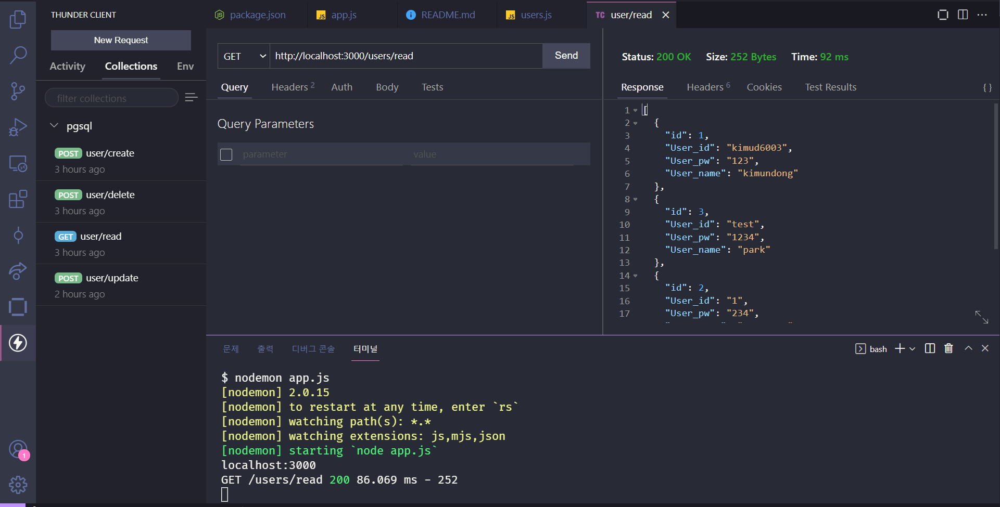

## Begin Backend

## 숙제

- `pgsql-express` 폴더는 `postgresql` 과 `express`를 연결한 서버 폴더이다.

- 숙제 1: 해당 폴더의 구조를 이해하고, ./router의 있는 `user`의 crud를 완성해보자 (또한 전체 코드의 구조를 이해해야합니다)

> CRUD란 Create(생성), Read(읽기), Update(갱신), Delete(삭제)을 의미

- 해당 CRUD는 `Update` 와 `Delete`의 내용이 비워져 있는 상태이다.

- 숙제 2: async와 await를 왜 사용했는지 파악해보자 (Promise란?)

  - 만약 이해가 안간다면 해당 강의를 보고 정리
    - [callback](https://www.youtube.com/watch?v=gYTz7LMQQsM)
    - [callback2](https://www.youtube.com/watch?v=KzQ6bW3AJEg)
    - [Promise1](https://www.youtube.com/watch?v=N19O3LtuGe0)
    - [Promise2](https://www.youtube.com/watch?v=Iee488sR5_g)
    - [Promise3](https://www.youtube.com/watch?v=e9f1TyIlAzs)
    - [async/await](https://www.youtube.com/watch?v=G-tHfpfeFGQ)

- 숙제 3: 전체코드를 본인의 스타일로 바꾸고 업그레이드시켜보자!
